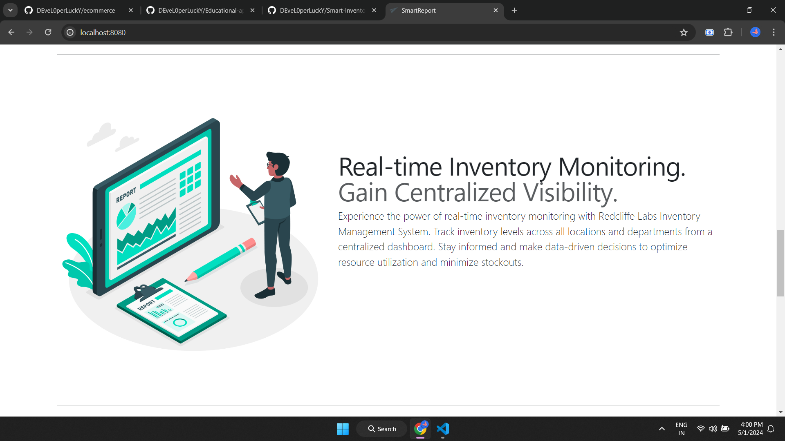
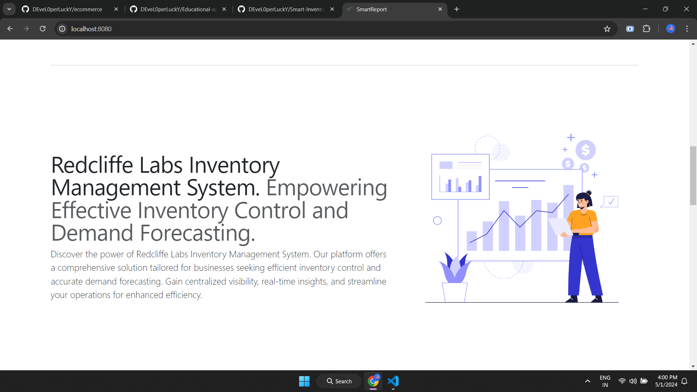
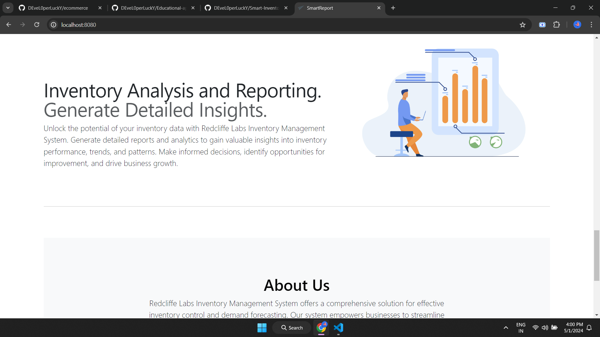
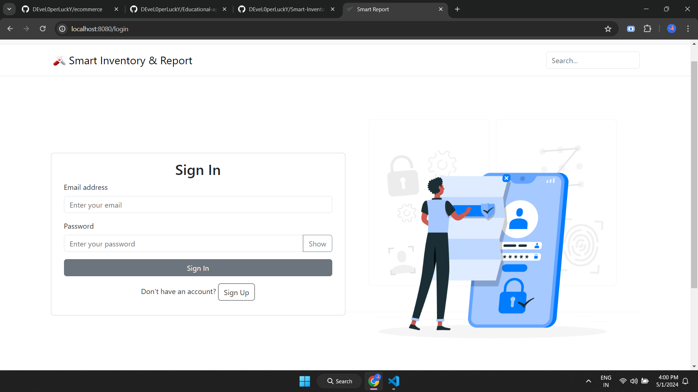
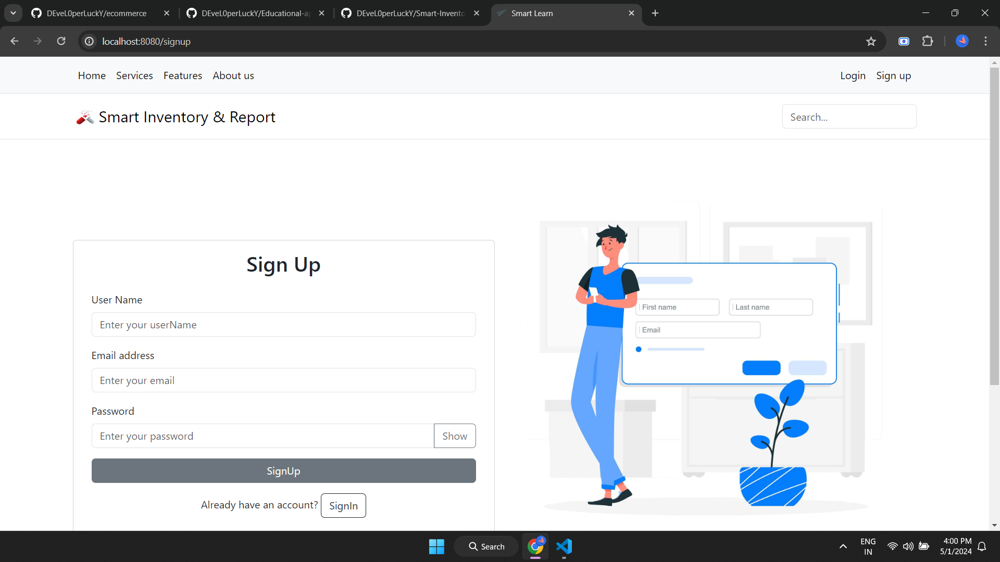
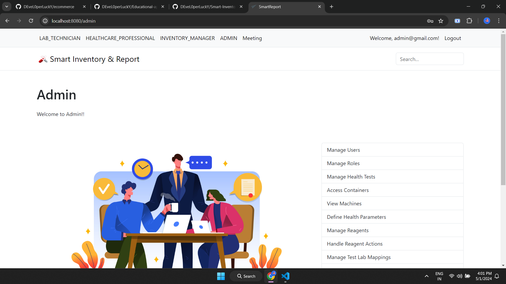

# SmartReport

## Video Demo

- [Watch the video demo of the application in Drive](https://drive.google.com/file/d/1R8z4fvco77grLeyQsp2lYzOLQQatcMgC/view?usp=sharing)
- [Watch the video demo of the application on YouTube](https://www.youtube.com/watch?v=8yAbzWp9KDc)

## Overview

SmartReport is a Spring Boot application designed for generating reports and managing inventory. It provides a user-friendly interface for accessing and manipulating data related to reports and inventory items.

## Screenshots

## Development

Update your local database connection in `application.properties` or create your own `application-local.properties` file to override settings for development.

During development, it is recommended to use the profile `local`. In IntelliJ, `-Dspring.profiles.active=local` can be added in the VM options of the Run Configuration after enabling this property in "Modify options".

After starting the application, it is accessible under `localhost:8080`.

## Build

The application can be built using the following command:

Start your application with the following command - here with the profile `production`:

If required, a Docker image can be created with the Spring Boot plugin. Add `SPRING_PROFILES_ACTIVE=production` as an environment variable when running the container.

## Further readings

- [Maven docs](https://maven.apache.org/guides/index.html)
- [Spring Boot reference](https://docs.spring.io/spring-boot/docs/current/reference/htmlsingle/)
- [Spring Data MongoDB reference](https://docs.spring.io/spring-data/mongodb/docs/current/reference/html/)
- [Thymeleaf docs](https://www.thymeleaf.org/documentation.html)
- [Bootstrap docs](https://getbootstrap.com/docs/5.3/getting-started/introduction/)
- [Learn Spring Boot with Thymeleaf](https://www.wimdeblauwe.com/books/taming-thymeleaf/)
